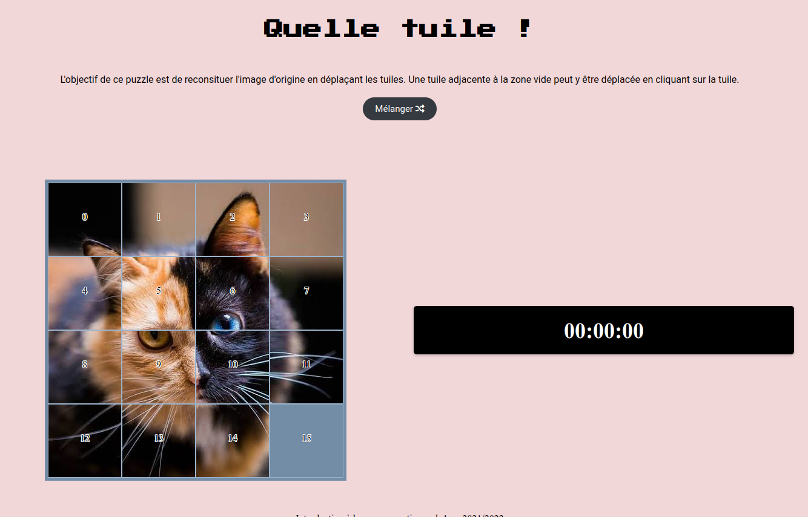
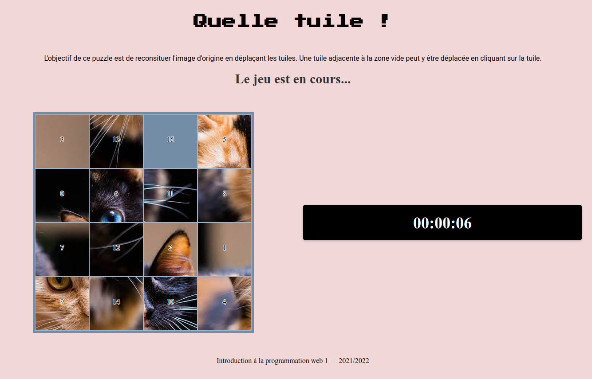

# Which Tile?

## Installation

```bash
$ git clone https://github.com/FellahAbdel/tile-game.git
```

## Usage

Open the index.html file in a browser, you should expect to see this:



click on the `Mélanger` button to start the game, once the game is started the shuffle button will disappear the timer will start.


